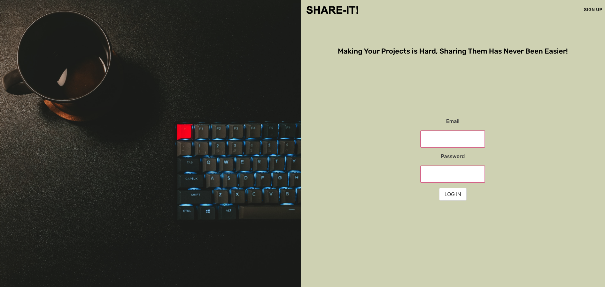
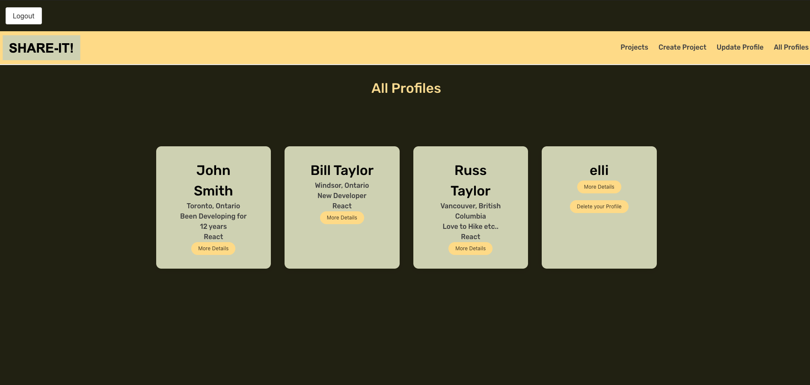
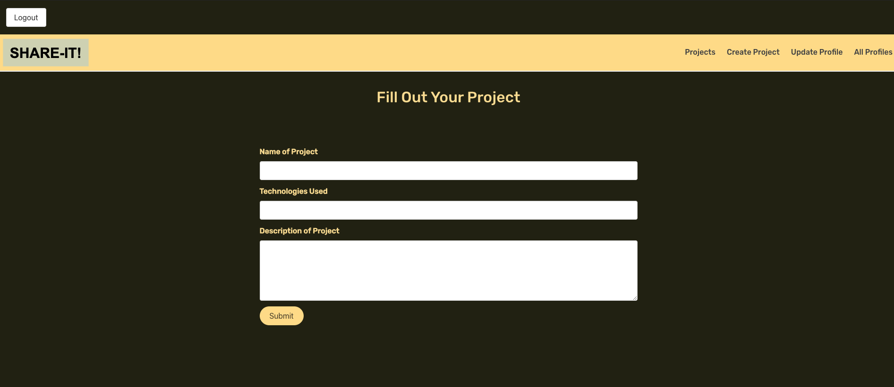

# Share-it 

Welcome to Share-it a site made for developers by developers. Our aim is to create a site that lets  developers, recruiters, and all the good people out there who love learning to code , weather you are starting out or more experienced have access to a platform to share ideas, makes friends , get jobs all from the comfort of your ergonomic chair. So welcome our credo is when you have a good idea just share-it. 

## Link to Deployed Project

[Share-It](https://share-it-app.herokuapp.com/)

## Screenshots

  
## Technologies Used

* Node.js
* Express
* MongoDB
* React
* JWT
* Styled Components
* Bulma

   
## Next Steps

* Implement the ability to upload images
* Implement a "sort-by frontend, backend, or fullstack" feature 
* Build a share feature so it's easy for developers to send out links to their projects straight from the site.

### ERD

[Link to ERD](https://lucid.app/lucidchart/d3e8c572-7226-4910-9774-e2530d0e395d/view?page=0_0#)

### Figma

[Link to Wireframe](https://www.figma.com/proto/blwfTZN7Z2SaYoudVlKtOv/Untitled?node-id=7%3A2&scaling=min-zoom&page-id=0%3A1&starting-point-node-id=7%3A2&show-proto-sidebar=1)

### Trello
[Link to Trello Board](https://trello.com/b/rSW2Wopc/project-4)
## Developers

* Elli Raynai
* Darren Glew
* Alexander Medici 

  
